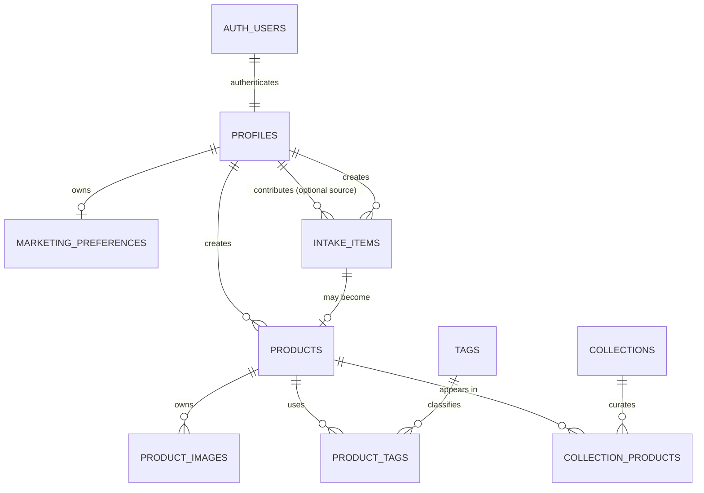

# REVA Data Architecture

## Purpose and Authority

This document is the authoritative, evolving description of REVA's approved data model. It explains why the model exists, the boundaries it preserves, and the constraints future implementation must respect.

It has a different responsibility from the project's other governing documents:

- `AGENTS.md` is the permanent Engineering Constitution and Level 3 authority.
- `DATA_ARCH.md` records the approved data architecture and evolves with approved data-model changes.
- `SPRINTS.md` records development history and milestones.

Changes to this document must follow the architectural change rules in `AGENTS.md`. A migration that changes the approved model updates this document in the same architectural change.

## Implemented Architecture Boundary

The schema, authorization foundation, Profile provisioning, and first public Product read surface are implemented through versioned migrations. Supabase is the current infrastructure provider; the domain contracts and service boundaries remain provider-independent.

The implemented database surface contains the ten approved business tables in `public`, private helpers in `private`, and the deliberately small published-Product read surface in `api`. Database access is default-deny: base business tables are not anonymously readable. Authentication and normal request-scoped repositories use the publishable provider context together with the real session where one exists; no privileged provider credential is part of ordinary application data access.

The visible Catalog and Product Detail still use editorial static presentation data. The public Product repository and `api` projections establish the safe read path but do not yet supply real Product rows or image delivery to the public UI. The next planned implementation milestone is recorded in `SPRINTS.md`; deferred decisions are recorded in `TO_CONSIDER.md`.

## Business Model

REVA currently supports three connected services.

### Buy

Visitors discover REVA through the public catalog and editorial collections:

```text
/catalogo -> /colecciones/[slug] -> /productos/[slug] -> Configured Official Contact Channel
```

REVA does not currently implement carts, orders, payment, or checkout.

### Sell

A person provides a garment for REVA to sell. REVA receives and registers the physical garment as an Intake Item. REVA decides whether it enters the catalog, then creates and controls the official Product if appropriate.

The contributor never creates a public Product directly. REVA controls its catalog information, price, condition, images, tags, publication, SKU, and presentation.

### Donate

A person provides a garment without expecting payment. REVA records the physical garment as an Intake Item and chooses one of three destinations:

- Catalog / second-life sale
- Community donation
- Textile recycling

A garment that does not enter the catalog never requires product photography, tags, price, measurements, condition rating, slug, or SEO content.

## Core Domain Principle

An **Intake Item** is one physical garment received and processed by REVA.

A **Product** is one unique selling opportunity created and controlled by REVA from an Intake Item.

Every Product originates from exactly one Intake Item. An Intake Item creates zero or one Product. There is no inventory quantity and no Product variants in the current architecture.

## Conceptual Entity Model



`site_testimonials` is independent editorial trust content. It intentionally has no Profile or Product relationship.

## Intake Architecture

`intake_items` is intentionally lightweight. It registers every garment REVA receives while avoiding product-only work for garments that never enter the catalog.

| Field | Responsibility |
|---|---|
| `id` | Stable Intake Item identity. |
| `source_type` | How the garment entered REVA: `sell` or `donate`. |
| `destination` | REVA's decision: `catalog`, `community_donation`, or `textile_recycling`; it may be unset while undecided. |
| `source_profile_id` | Optional Profile of a registered contributor. |
| `created_by_profile_id` | Required admin Profile that created the Intake Item record. |
| `acquisition_cost` | Private internal cost paid by REVA for a sell intake. |
| `received_at` | Physical receipt date. |
| `created_at`, `updated_at` | Audit timestamps. |

`source_type` and `destination` answer different questions. A donated garment may validly have `destination = catalog`.

`acquisition_cost` uses an exact decimal representation. It is `null` for a donation because no purchase occurred; `0.00` would ambiguously imply a zero-cost purchase. For a sell intake, it must be greater than zero. Monetary values are GTQ in the current Guatemala-only business scope; a per-row currency field is intentionally not stored yet.

`source_profile_id` is optional so authentication never becomes a prerequisite for selling or donating. No personal data for an unregistered contributor is added until an explicit product need and privacy design justify it.

## Product Architecture

A Product is REVA's official, unique commercial record for one Intake Item. It is not an inventory record, generic product template, or a copy of Intake provenance data.

Its sole public canonical location is:

```text
/productos/[slug]
```

Tags, filters, gender, type, and collection membership must never create alternative Product URLs.

| Field | Responsibility |
|---|---|
| `id` | Stable Product identity. |
| `intake_item_id` | Required unique source Intake Item. |
| `created_by_profile_id` | Required admin Profile that created the official Product record. |
| `sku` | Internal operational identifier. |
| `slug` | Stable public URL identity. |
| `title`, `description` | Public product and editorial information. |
| `price` | Exact public selling price. |
| `brand` | Simple filterable brand text. |
| `audience` | Controlled single merchandising audience: `hombre`, `mujer`, `ninos`, or `unisex`. |
| `garment_type` | Controlled structured catalog attribute, persisted as a stable application-owned value. |
| `color` | Controlled structured catalog attribute. |
| `material_details` | Human-readable material or composition information. |
| `size_label`, `measurements` | Sizing information. `size_label` is nullable manufacturer/garment information, currently captured through Product Manager's controlled application vocabulary. Measurements are a flexible structured object, normally in centimeters. |
| `condition_rating`, `condition_notes` | Compact persisted condition signal and any product-specific notes. The human-readable label is derived by the application. |
| `status` | Commercial lifecycle: `draft`, `published`, `reserved`, `sold`, `archived`. |
| `published_at`, `public_media_ready_at`, `created_at`, `updated_at` | Publication, completed public-media materialization, and audit timestamps. |

Products do not store `source_profile_id`, `acquisition_cost`, or `received_at`. Those facts belong exclusively to the Intake Item.

### SKU policy

SKU is an internal, unique operational identifier. It is initially generated in the normalized sequence:

```text
RV-000001
RV-000002
RV-000003
```

It must not encode garment type, brand, category, or other classification. It may be deliberately edited by an authorized admin when operations require it.

### Slug policy

Slug is Spanish, lowercase, ASCII, kebab-case, and globally unique. It is initially derived from the Product title but does not change when the title changes. An authorized admin may deliberately change it when needed.

### Condition model

`condition_rating` is the only persisted source of truth. It is limited to the approved range `0` through `3`:

| Rating | Derived application label |
|---:|---|
| `3` | `Nuevo` |
| `2` | `Como nuevo` |
| `1` | `Semi nuevo` |
| `0` | `Con detalles` |

`condition_label` is never stored or accepted as Product input. A centralized application mapping derives it from `condition_rating`, so a Product cannot persist contradictory condition values. Rating `3` always represents the best condition.

`condition_notes` is optional, product-specific text for wear, repairs, or other details that neither rating nor label can communicate.

## Product Images

Products exclusively own their images. A Product may have a variable number of images.

| Field | Responsibility |
|---|---|
| `id` | Image identity. |
| `product_id` | Required Product owner. |
| `storage_key` | Provider-neutral storage reference. |
| `alt_text` | Accessible, product-specific description. |
| `position` | Manual image ordering. `position = 1` is always the primary image. |
| `width`, `height`, `mime_type` | Image delivery metadata. |
| `created_at` | Audit timestamp. |

There is no `is_primary`, because it duplicates `position = 1`. Provider delivery URLs, signatures, transformations, and CDN behavior are infrastructure concerns resolved through `ImageService`, never stored as Product business data.

Product media is processed before persistence. Product Manager accepts approved source photography through a trusted Node boundary, corrects orientation, strips unnecessary metadata, and persists only optimized WebP objects under provider-neutral immutable keys. Draft media remains in private Storage and is resolved into short-lived administrator preview URLs.

The private `product-media` bucket is authoritative operational media. Publication materializes immutable WebP delivery copies in the public `public-product-media` bucket using the opaque ProductImage identity. The public bucket is delivery materialization, never a second editable media library. Public-bucket writes and deletes require a real ProductImage identity whose Product is `published` with `public_media_ready_at` still `NULL`; this is the only lifecycle staging state for materialization or cleanup. A Product is projectable only when its lifecycle is `published` and `public_media_ready_at` confirms every public copy exists. Public presentation receives delivery-safe URLs and image metadata through `ImageService`, never a private storage key. Returning a Product to draft first removes it from public projections, then removes only its public delivery copies; private source media remains available for correction and later republication.

The current evidence-backed operational policy is deliberately distinct from Product business data:

| Stage | Current policy |
|---|---|
| Accepted source | JPEG/JPG or PNG, at most 12 MiB. |
| Decoded-image protection | At most 24 MP. |
| Processing | Trusted Node-side Sharp processing with auto-orientation and no upscaling. |
| Output | WebP, maximum long edge 2560 px, quality 82. |
| Metadata | Unnecessary EXIF, GPS, and camera metadata is not persisted. |
| Storage | Only the optimized WebP is stored; its Storage-object ceiling is 5 MiB. |

These are application-owned operational defaults supported by real REVA photography. They may change with reviewed evidence and do not become Product fields or provider-specific domain rules. Production hosting must support the approved 12 MiB source-media ingress requirement; hosting limitations must not silently reduce trusted image quality or require normal operators to pre-compress photographs.

## Discovery Architecture

### Structured Product filters

The catalog's stable Product filters are:

- Price
- Size
- Brand
- Color
- Condition
- Material
- Garment type

These are simple Product fields. REVA deliberately does not create Brands, Categories, Colors, or Materials reference tables in the current architecture.

`garment_type` is not free-form Product Manager input. The application owns a centralized, controlled vocabulary of stable values and Spanish display labels. A value is not a URL or SEO slug; it is an operational discovery value. This keeps labels independently editable while avoiding inconsistent filtering data.

When a received garment does not fit the current vocabulary, REVA reviews and deliberately adds an approved value to that centralized configuration. A database-backed or admin-managed taxonomy is deferred until centrally editing that configuration becomes operationally limiting.

`color` is likewise one controlled, application-owned Product discovery classification during normal Product Manager entry. It persists a stable normalized value while Spanish labels remain presentation. The current vocabulary includes deliberate `bicolor` and `multicolor` classifications, not a Product-to-Color relationship; the model does not currently retain constituent colors. The vocabulary remains preliminary and evolves deliberately from real operational evidence rather than through arbitrary operator text.

`audience` is a separate, single structured merchandising classification. Its stable persisted values are `hombre`, `mujer`, `ninos`, and `unisex`; labels remain application presentation. It is nullable while a Product is an incomplete draft and is required before it becomes public. It is not a Tag and does not describe a contributor or customer's identity. It supports future Catalog filtering without collapsing flexible style or season discovery into a rigid taxonomy.

Product Manager currently captures `size_label` through a small, centralized controlled alpha-size vocabulary and persists the chosen value or `NULL` when no label is indicated. This is an operational guardrail, not a permanent universal sizing model: alpha, waist, numeric, European, children's, and manufacturer-specific systems remain legitimate future sizing facts. `measurements` stays independent of `size_label`; either may be absent in a draft, while publication requires a non-empty size label or measurements.

### Tags

Tags are controlled REVA discovery configuration, not user-created text and not SEO landing pages. A Product may have many Tags and a Tag may be assigned to many Products.

Current Tag groups are:

- `style`
- `season`

`tags` has a name, group, manual `position`, and `is_filter_visible`. The latter means “show in the normal catalog filter UI”; a hidden Tag remains assignable and useful internally.

`product_tags` contains only the Product and Tag relationship. It prevents duplicate assignment and does not own product order or public URLs.

## Collections

Collections are manually curated, indexable editorial landing pages at:

```text
/colecciones/[slug]
```

Each Collection has title, description, slug, and status (`draft`, `published`, `archived`). Collections do not nest and do not own independent media; their visual presentation comes from their Products.

Products and Collections are many-to-many. `collection_products.position` controls manual editorial Product ordering within each Collection.

## Profiles and Authorization

Supabase Auth's `auth.users` owns authentication identity, credentials, sessions, recovery, and verification. `profiles` owns REVA business identity.

`profiles.id` is the immutable primary-key reference to `auth.users.id`. It has one authorization field:

- `customer`
- `admin`

There are no roles, user_roles, permissions, moderator, seller, catalog_manager, or super_admin entities.

An admin is a customer with privileged REVA administration capability: Product Manager access, Product and image management, Tag and Collection management, publication, and lifecycle changes.

### First admin bootstrap

Authentication identity and Profile provisioning are implemented. The secure first-admin bootstrap process is:

1. A verified person creates the first REVA account through the approved application signup flow.
2. The Auth-user provisioning trigger creates that user's Profile with `role = customer` by default in the same Auth-user creation transaction.
3. A project owner verifies the user identity in the Dashboard and manually promotes the specific Profile to `admin` through the Supabase Dashboard's privileged database administration path.
4. The user refreshes the authenticated application session after promotion. Re-sign-in is required only if that browser session has ended: RLS evaluates `profiles.role` in PostgreSQL rather than trusting a role copied into browser state.

There is no public “Become Admin” flow and no client-side promotion operation.

`profiles.role` is REVA's source of truth. The implemented RLS/grant model denies customer Profile updates, including role changes. If future editable Profile fields are introduced, their authorization must preserve the same prohibition on changing `role`; interface visibility alone is never authorization.

`raw_user_meta_data` must never be trusted for roles because end users can modify it. `raw_app_meta_data` is protected from user writes and may later be used as a server-maintained JWT-claim mirror only if measured RLS performance justifies it. It is not the initial source of truth because duplicating role data creates synchronization and token-refresh risk.

Supabase documents `auth.users` as an Auth-owned schema that should be referenced by its immutable primary key, and recommends protecting public Profile data with RLS. [User Management](https://supabase.com/docs/guides/auth/managing-user-data)

### Authentication email delivery

The implemented authentication mechanism is email/password with hosted email confirmation. The application uses a request-scoped SSR client, secure cookie propagation, a session-refresh proxy, server actions for sign-in/sign-up/sign-out, and `/auth/confirm` to exchange the confirmation token for a cookie-backed session. The Profile-provisioning trigger creates exactly one matching `customer` Profile for each new `auth.users` record.

The hosted development environment uses temporary Custom SMTP through Mailtrap Email Sandbox to capture Auth emails while validating signup confirmation. SMTP credentials are owned by Supabase's hosted Auth configuration; they are never application environment variables, source-controlled configuration, or REVA business data.

This is development-only infrastructure, not production email architecture. Before launch, REVA requires an approved Production Identity / Email configuration milestone covering the official domain and deployment URL, transactional-email provider, sender identity, domain verification, SPF, DKIM, DMARC, deliverability, production Auth URLs and templates, password-reset and other transactional templates, rate limits, and the retirement or replacement of the development SMTP configuration.

## Marketing Preferences

Marketing preferences are intentionally separate from Profile identity. The current model is one-to-one with Profiles and has only:

- `profile_id`
- `is_marketing_opted_in`
- `updated_at`

This is sufficient for reversible consent without building campaign, delivery, or channel-preference infrastructure.

## Testimonials

Site Testimonials are REVA-curated editorial trust content. They may transcribe customer feedback or direct statements, but users do not submit them through the website.

They have no required Product or Profile relationship and no public review-submission workflow.

## Security Boundaries

| Data | Access boundary |
|---|---|
| Published Product facts | Public only through the deliberately allowlisted `api` Product projections. |
| Testimonials | Editorial data. No public database projection or public repository is implemented yet. |
| Intake Items | Admin-only. |
| `acquisition_cost` | Admin-only internal commercial data. |
| `source_profile_id` | Private contributor attribution. |
| `created_by_profile_id` | Internal operational audit data. |
| Product storage keys | Internal infrastructure data; delivery URLs are resolved through `ImageService`. |
| Marketing Preferences | The owning authenticated Profile only. |

RLS protects rows, but it is not a complete presentation boundary: public Product contracts must deliberately select only safe fields. The server/service/repository boundary remains mandatory.

Supabase requires RLS and least-privilege grants for secure browser Data API access. Secret and service keys bypass RLS and must never enter a client bundle. [Securing your data](https://supabase.com/docs/guides/database/secure-data)

## Authorization and Access Boundaries

REVA uses a default-deny model. The intended application path for every business-table read and write is server-mediated:

```text
Server Component or Server Action -> Service -> Repository -> Supabase/PostgreSQL
```

Anonymous visitors receive no direct privileges or RLS policies on business tables. The implemented public surface is limited to published Product projections; public Collection, Tag, and Testimonial projections remain deferred. Each future safe projection must exclude Intake provenance, creator identities, acquisition cost, storage keys, and other operational fields. Server rendering preserves public discovery and SEO without exposing underlying business tables through the browser Data API.

RLS remains defense in depth for direct PostgREST-style access:

- An authenticated customer may select only their own Profile.
- An authenticated customer may select, insert, and update only their own Marketing Preferences. Marketing Preferences are not deleted in the current model.
- Customers cannot insert Profiles, update any Profile field, change `profiles.role`, read another Profile or another user's preferences, or access Intake merely because `source_profile_id` matches their identity.
- Operational entities (`intake_items`, `products`, `product_images`, `tags`, `product_tags`, `collections`, `collection_products`, and `site_testimonials`) are managed only by administrators.
- Administrators do not receive access to other users' Marketing Preferences merely because they are administrators. An administrator retains the same own-preference access as a customer.

`profiles.role` remains the authorization source of truth. A private, fixed-search-path security-definer authorization helper may read it for RLS evaluation without policy recursion; it has no mutation capability and no public-schema exposure. User metadata, including `raw_user_meta_data`, is never an authorization source.

Deletion is intentionally conservative. Profiles, Marketing Preferences, Intake Items, Products, Collections, Tags, and Site Testimonials are not generally deleted through the application. Products are archived; Collections and Testimonials change lifecycle or publication state. Only `product_tags` and `collection_products` may be deleted as pure relationship records. Product Image deletion uses an explicit admin-only server workflow that coordinates private Storage and metadata with documented compensation; it does not claim cross-system atomicity.

The RLS auto-enable event-trigger helper belongs in the private schema, uses a fixed safe search path, and has no direct execute grant for browser roles. It preserves automatic RLS activation for future public tables without exposing a callable public `SECURITY DEFINER` helper.

## Security Contexts

REVA has four distinct security contexts. Server execution alone does not create elevated authority; each context uses only the access required by its purpose.

| Context | Credential and database role | Allowed responsibility |
|---|---|---|
| Public visitor | Publishable provider context without a user session; database `anon` role | Read only intentionally public projections, through server-rendered application paths. It has no business-table access. |
| Authenticated customer | Publishable provider context plus the customer's verified session; database `authenticated` role | Customer-owned operations such as their own Profile read and Marketing Preference management, subject to RLS. |
| Authenticated admin | Publishable provider context plus the administrator's verified session; database `authenticated` role plus `profiles.role = admin` evaluated by RLS | Approved operational administration. It preserves `auth.uid()` and does not bypass RLS. |
| Privileged infrastructure | Server-only privileged provider credential or privileged Dashboard infrastructure | Explicit bootstrap, provider administration, recovery, maintenance, or trusted background work where a user context cannot exist. |

Ordinary services and repositories use the public, customer, or admin context bound to the current request. Privileged infrastructure is not an ordinary request context and must never become a convenience fallback for Product, Collection, Profile, or other routine repositories.

### Authentication context

Authenticated application operations follow this request-scoped path:

```text
Browser
-> Server Action or Route Handler
-> request-scoped SSR client
-> verified session identity
-> Service
-> Repository
-> Supabase/PostgreSQL
-> RLS
```

The browser does not directly query REVA business tables. Session cookies propagate the authenticated identity to server-side provider clients, so PostgreSQL receives the real user JWT and `auth.uid()` can enforce ownership. Server-side identity checks validate the session; client-provided IDs, role state, and route visibility are never trusted authorization signals.

### Public data surface

Public catalog reads use the exposed `api` schema. Its only current public Product objects are these published-only projections:

| Projection | Public fields |
|---|---|
| `api.published_product_previews` | `slug`, `title`, exact decimal `price`, `audience`, `brand`, `garment_type`, `color`, `size_label`, `condition_rating`, and primary-image delivery metadata |
| `api.published_product_details` | Preview facts plus `description`, `material_details`, `measurements`, and `condition_notes` |
| `api.published_product_images` | Product slug, opaque image identity, alternative text, position, width, and height for the ordered public gallery |

Each projection explicitly allowlists its columns and enforces `products.status = 'published' AND products.public_media_ready_at IS NOT NULL`. It never uses `SELECT *` and never exposes Intake data, acquisition cost, contributor or creator identity, SKU, raw Storage keys, draft or operational data, hidden Tags, or unpublished Collections.

The projections are intentionally readable through the Supabase Data API by `anon` and `authenticated` only after both schema usage and view `SELECT` are granted. The `api` schema must be listed as an exposed Data API schema. No table in `public` receives anonymous access through this design.

Because the underlying business tables retain default-deny RLS for anonymous callers, these fixed allowlisted views use their migration owner to read the approved public fields. The publication predicate, fixed column contract, and narrowly scoped view grants are therefore mandatory security boundaries and require review whenever a projection changes.

The views are intentionally definer-owned in the current development design. This produces a generic Supabase Security Advisor warning and remains subject to the explicit pre-launch review recorded in `TO_CONSIDER.md`; it is not silently considered permanently resolved.

`SupabasePublicProductRepository` maps projection rows into `PublishedProductPreview` and `PublishedProduct`. It preserves prices as canonical decimal strings inside `Money`, derives condition language in the application, and does not return persistence rows. `PublicProductImageService` resolves only opaque public image identities into stable delivery URLs; private `ProductImage.storage_key` stays internal.

These objects are intentional public data surfaces. A direct Data API request to one must reveal no more than REVA intentionally publishes on its public website. Server Components remain the normal REVA application path so public discovery is rendered as HTML rather than fetched by UI components.

### Repository context

Repositories receive an explicit, request-scoped provider client or adapter rather than importing a global privileged client. The bound context makes the caller's authorization visible at construction time:

- Public catalog repositories use published-only safe projections.
- Customer repositories use the verified customer session.
- Admin repositories use the verified admin session and remain subject to RLS.

This boundary prevents an elevated credential from silently becoming the default for unrelated data access.

### Implemented repository adapters

`SupabaseProfileRepository` is bound to the verified request identity and maps only the current caller's Profile into REVA's provider-independent Profile contract. It does not accept an arbitrary browser-supplied Profile identifier.

`SupabasePublicProductRepository` is bound to the request-scoped publishable context and can read only the published `api` projections defined above. It maps database rows into public Product contracts; it does not query `public.products` and has no write methods.

Product Manager uses separate feature-specific, session-bound Supabase adapters and narrow RPCs for draft, media, and publication lifecycle operations. These preserve the authenticated administrator context and do not turn public Product reads into a generic write repository.

### Image delivery boundary

`ProductImage.storage_key` remains internal infrastructure data. `ImageService` transforms internal image data into `ProductImageDelivery`, which may contain a delivery URL, dimensions, alternative text, and position. Public presentation contracts never receive raw Storage keys or storage architecture.

## Intentionally Postponed

The current architecture does not include:

- Orders, payments, checkout, carts, or inventory quantity
- Rewards, promotional codes, or participation incentives
- Marketplace sellers or seller dashboards
- Donation or recycling partner management
- Full-text search
- A complex workflow engine or event sourcing
- A generic media library
- Brand, Category, Color, or Material reference tables
- Public review submission

These capabilities are intentionally absent, not forgotten.

## Evolution Rules

This document evolves only through approved architectural changes. A migration must not silently introduce a new data concept, relationship, provider dependency, public exposure, or authorization model.

When an approved implementation changes the data model, update this document in the same change. When a decision is still uncertain, keep it out of migrations until it has an explicit owner and approval.
